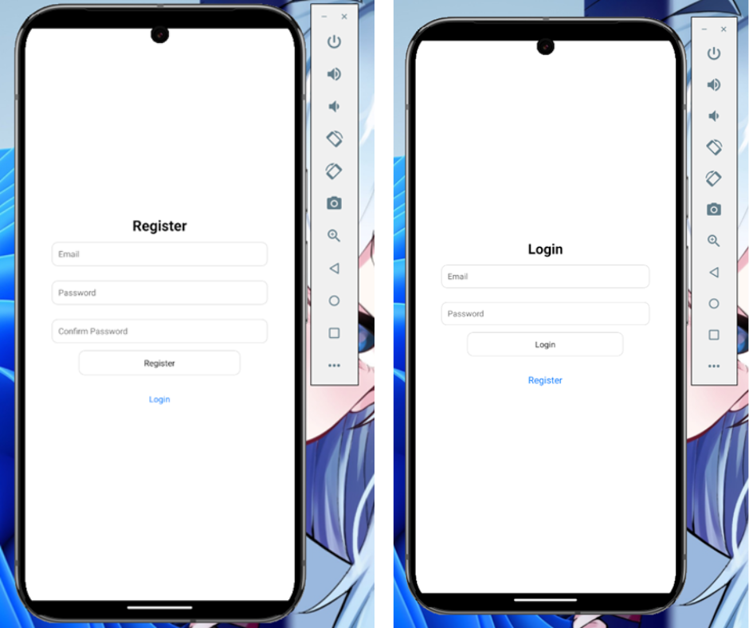
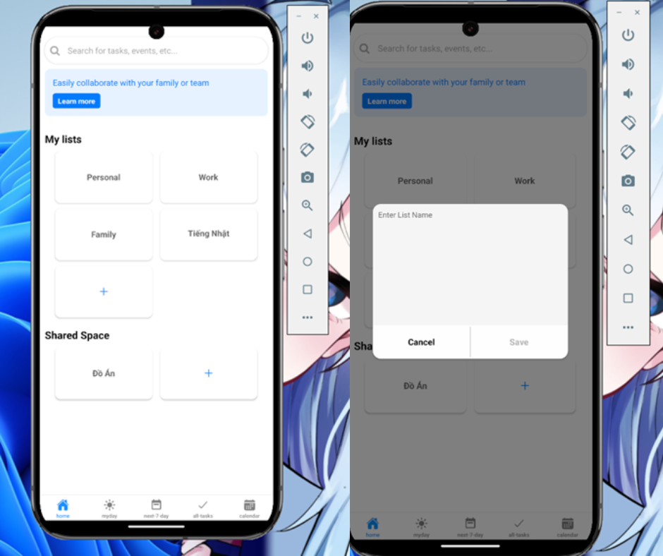
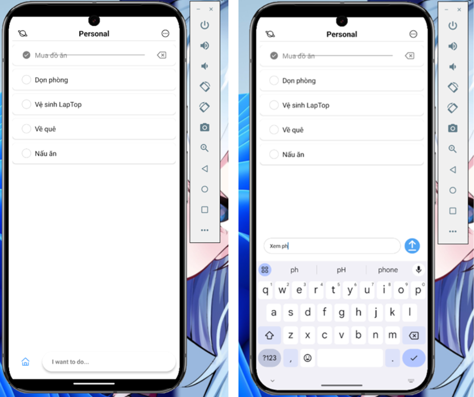
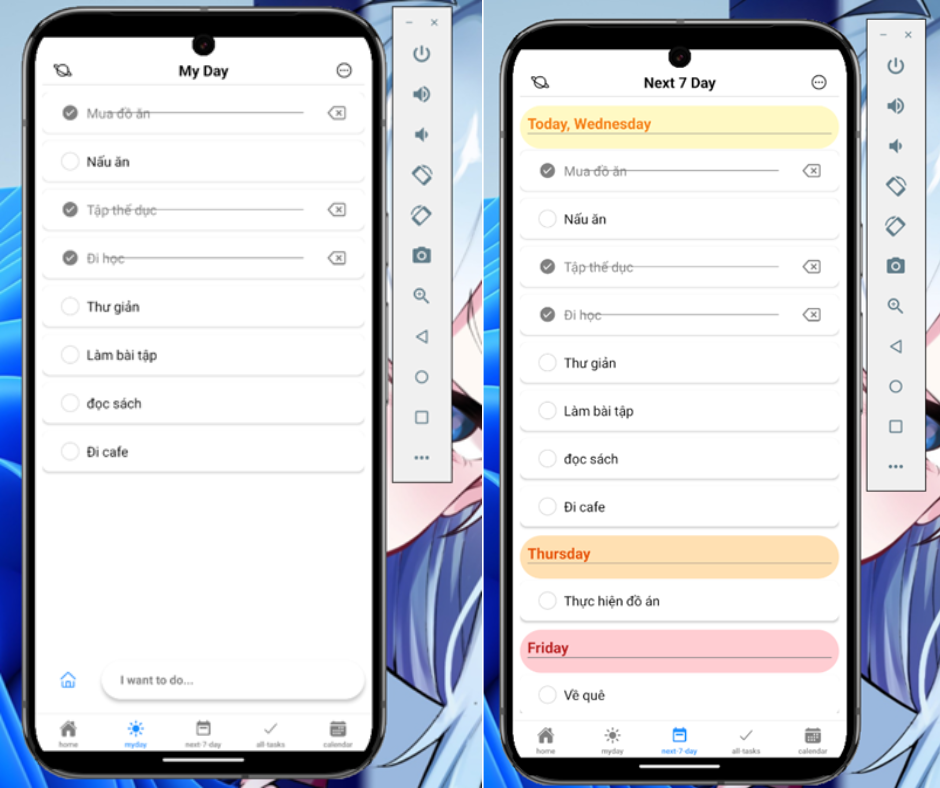
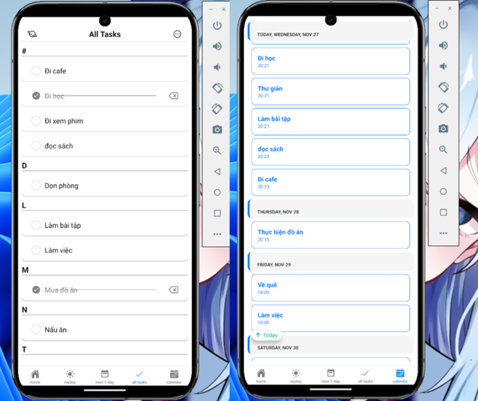
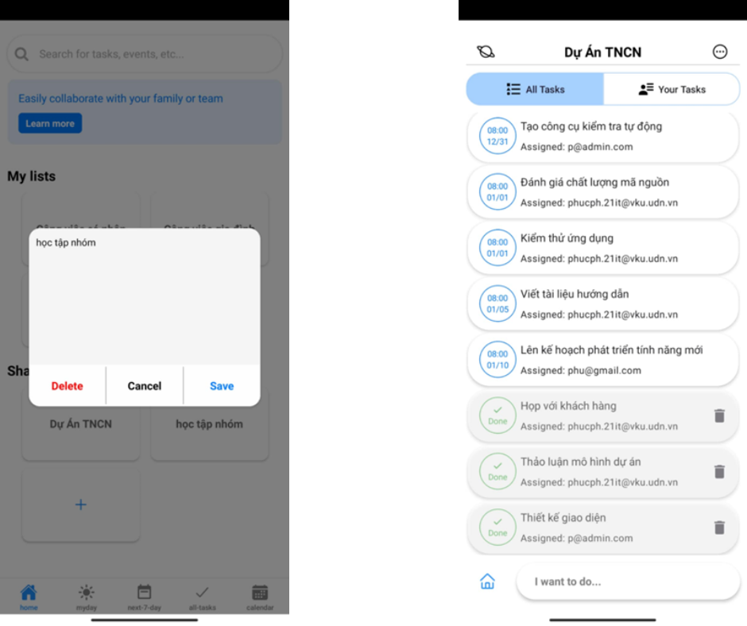
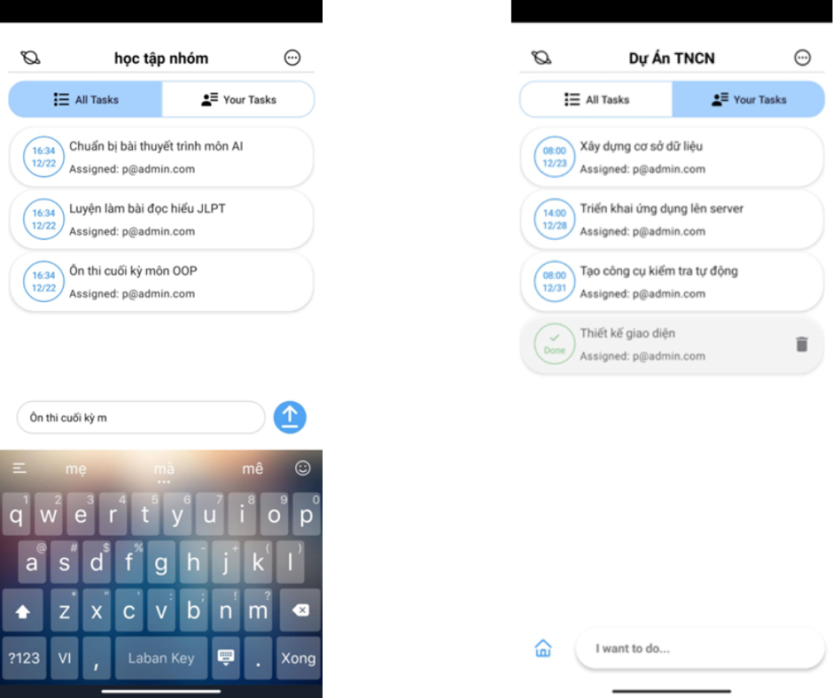
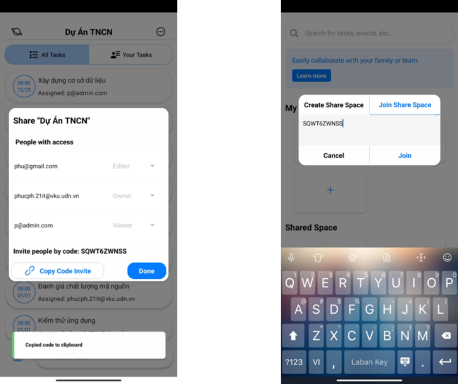

# Welcome to My app 👋

This is an [Expo](https://expo.dev) project created with [`create-expo-app`](https://www.npmjs.com/package/create-expo-app).

Dự án này được thực hiện nhằm xây dựng 1 ứng dụng lập lịch công việc có thể chạy được trên nhiều nền tảng như Web, android, IOS.
Các chức năng chính sẽ bao gồm: Quản lý Danh sách các công việc, Quản lý các công việc, Chia công việc theo ngày, Lịch. Tạo không gian làm việc chung để dễ dàng chia sẽ tiến độ công việc giữa các thành viên.

Đây là dự án được thực hiện bởi các thành viên:

Phạm Hoàng Phúc

Phạm Quốc Phú

## Hướng dẫn cài đặt (Get started)

1. clone project

   ```bash
   git clone https://github.com/gin614pham/schedule.git
   cd .\schedule\
   ```

2. Install dependencies

   ```bash
   npm install
   ```

3. Start the app

   ```bash
    npx expo start
   ```

   ## File Word báo cáo

   [Báo cáo](demo/BaoCaoDoAnMonHoc.docx)

   ## File phân công nhiệm vụ

   [Phân công nhiệm vụ](demo/Phan%20cong%20nhiem%20vu%20nhom.docx)

   ## File quản lý công việc

   [Quản lý công việc](demo/Quản%20lý%20công%20việc.xlsx)

   ## File Json cho database

   [File databse](demo/database.json)

   ## Hình ảnh về sản phẩm

   ### Giao diện đăng nhập đăng ký

   

   ### Giao diện quản lý List

   

   ### Giao diện quản lý Task

   
   
   

   ### Giao diện quản lý ShareSpace

   
   
   

   ## Video demo sản phẩm

   [Video demo](https://drive.google.com/drive/folders/1_KIggM7HETQ7dCkrlUS4Wek2RvPDG8HU?usp=sharing)
